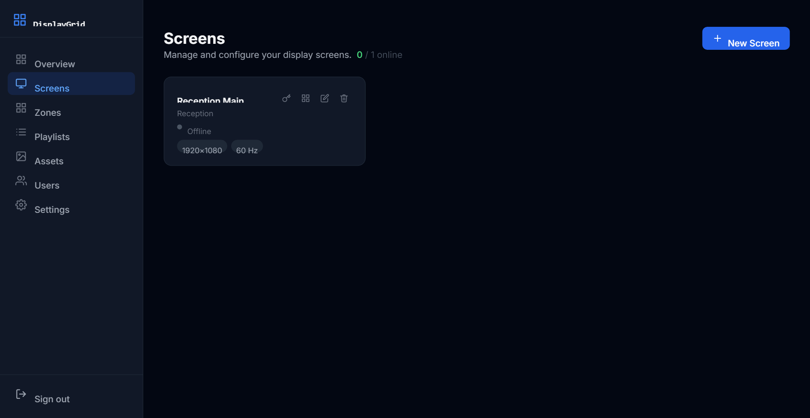
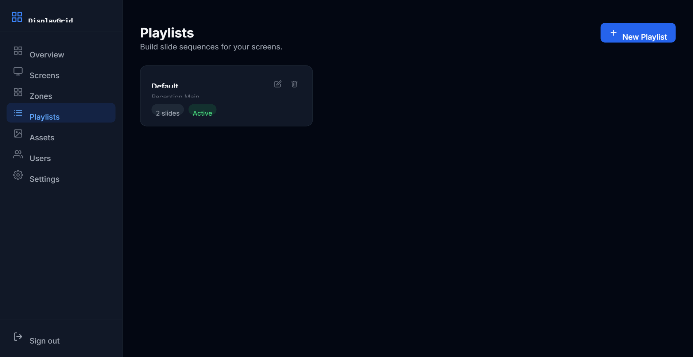
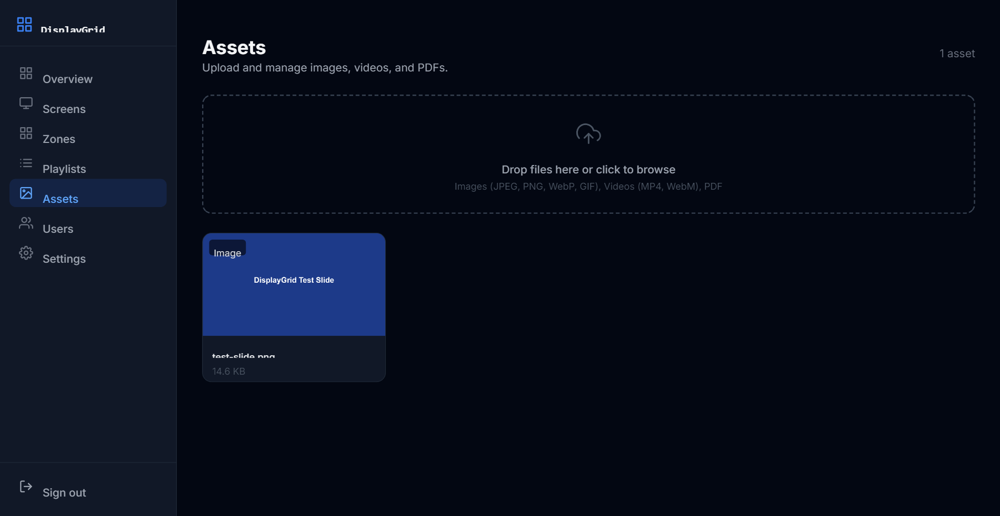
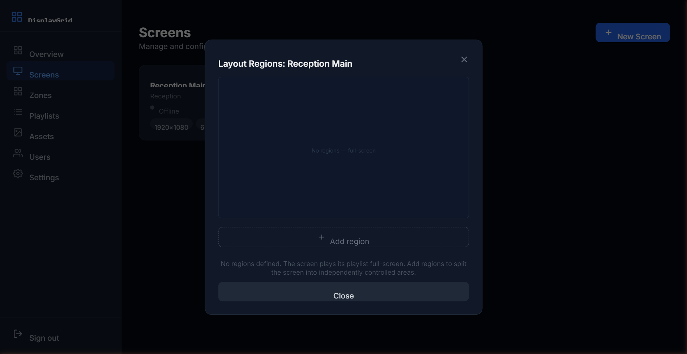
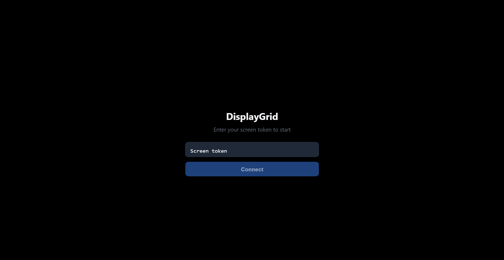

<div align="center">

# DisplayGrid

**Source-available, self-hosted digital signage for the places people gather.**

Restaurants, churches, schools, event venues, and community spaces.<br>DisplayGrid gives you full control over your screens without a cloud subscription, recurring fees, or vendor lock-in.

[](https://firstdonoharm.dev/version/3/0/law-mil-sv.html)
[](https://nodejs.org)
[](https://nextjs.org)
[](https://pnpm.io)
[](https://sqlite.org)

**[Website](https://joemighty.github.io/DisplayGrid/) · [Download](https://joemighty.github.io/DisplayGrid/download.html) · [Roadmap](https://joemighty.github.io/DisplayGrid/roadmap.html) · [REST API](https://joemighty.github.io/DisplayGrid/api.html) · [Guides](https://joemighty.github.io/DisplayGrid/guides/getting-started.html) · [Report a Bug](https://github.com/JoeMighty/DisplayGrid/issues)**

</div>

---

## Install

**Desktop apps** — the fastest way to run DisplayGrid. The Server App is fully self-contained: it creates its database on first launch, opens the dashboard in a native window, and keeps itself updated from GitHub Releases.

| App | Windows | macOS (Universal) | Linux |
|---|---|---|---|
| **Server** — dashboard + WebSocket server | [.exe](https://github.com/JoeMighty/DisplayGrid/releases/latest/download/DisplayGrid-Server-Setup.exe) | [.dmg](https://github.com/JoeMighty/DisplayGrid/releases/latest/download/DisplayGrid-Server.dmg) | [.AppImage](https://github.com/JoeMighty/DisplayGrid/releases/latest/download/DisplayGrid-Server-x86_64.AppImage) · [.deb](https://github.com/JoeMighty/DisplayGrid/releases/latest/download/DisplayGrid-Server-amd64.deb) |
| **Kiosk** — fullscreen display client | [.exe](https://github.com/JoeMighty/DisplayGrid/releases/latest/download/DisplayGrid-Kiosk-Setup.exe) | [.dmg](https://github.com/JoeMighty/DisplayGrid/releases/latest/download/DisplayGrid-Kiosk.dmg) | [.AppImage](https://github.com/JoeMighty/DisplayGrid/releases/latest/download/DisplayGrid-Kiosk-x86_64.AppImage) · [.deb](https://github.com/JoeMighty/DisplayGrid/releases/latest/download/DisplayGrid-Kiosk-amd64.deb) |

**Docker** — the whole server in one container; migrations run on boot and all state lives in a single volume:

```bash
docker run -d --name displaygrid \
  -p 3000:3000 -p 3001:3001 \
  -v displaygrid-data:/data \
  ghcr.io/joemighty/displaygrid:latest
```

Or `docker compose up -d` — [compose.yaml](compose.yaml) includes an optional HTTPS proxy profile.

**Raspberry Pi displays** run Chromium in kiosk mode pointed at your server. On a fresh Raspberry Pi OS Lite, one command sets everything up:

```bash
curl -sSL https://joemighty.github.io/DisplayGrid/pi-setup.sh | bash
```

It installs Chromium, asks for your server address and screen token, and boots the Pi fullscreen into your signage — see the [Raspberry Pi guide](https://joemighty.github.io/DisplayGrid/guides/raspberry-pi.html). No app install, no device maintenance: server updates reach every Pi instantly.

**Any browser display** — pair with zero typing by putting the token in the URL: open `http://<server>:5555/display?token=<token>` on the device (bookmark it, or use a memorable custom token like `lobby` set on the Screens page).

---

## Screenshots

<table>
  <tr>
    <td align="center"><b>Screens dashboard</b></td>
    <td align="center"><b>Playlist manager</b></td>
  </tr>
  <tr>
    <td></td>
    <td></td>
  </tr>
  <tr>
    <td align="center"><b>Asset library</b></td>
    <td align="center"><b>Multi-zone layout editor</b></td>
  </tr>
  <tr>
    <td></td>
    <td></td>
  </tr>
  <tr>
    <td align="center" colspan="2"><b>Display client (kiosk view)</b></td>
  </tr>
  <tr>
    <td colspan="2" align="center"></td>
  </tr>
</table>

---

## Features

**Content & playback**
- Drag-and-drop playlist builder with per-slide durations, transitions, and day/time/date scheduling (e.g. "show this playlist 1–24 December")
- Fillable slide templates — welcome screen, announcement, menu board, event schedule — with live preview, no design skills required
- Asset library for images, videos, and PDFs with automatic WebP optimisation
- Live streams: HLS (`.m3u8`) and WebRTC (WHEP) sources as slides — pair with go2rtc or MediaMTX to put IP cameras and OBS feeds on any screen
- Web page, custom HTML, clock, and text slides
- Multi-zone layouts: split any screen into independently controlled regions, each with its own playlist

**Screens & operations**
- Multi-screen management: resolution, refresh rate, rotation, colour profile, and LED panel grids per screen
- Real-time delivery — WebSocket pushes playlist changes to every display instantly
- Screen health monitoring: live online/offline status, last-seen, client IP
- Emergency override with one-tap presets (fire, lockdown, closure, and more) — broadcast a full-screen alert to every display instantly
- REST API with token auth — trigger the emergency override or read screen/playlist status from Home Assistant, n8n, or a script ([reference](https://joemighty.github.io/DisplayGrid/api.html))
- Offline resilience — displays cache their last playlist and keep playing through outages

**Platform**
- Role-based access: Super Admin, Admin, Operator, Viewer
- Kiosk lock: PIN-protected overlay with a configurable unlock key combo
- Auto-updating apps — kiosks update silently on restart, never mid-show
- Runs on Windows, macOS, Linux, Raspberry Pi, and Docker

See the [roadmap](https://joemighty.github.io/DisplayGrid/roadmap.html) for what's next — remote display operations, native widgets, and NDI support.

---

## Tech stack

| Layer | Technology |
|-------|-----------|
| Dashboard | Next.js 14 (App Router), Tailwind CSS |
| Database | SQLite · Drizzle ORM · better-sqlite3 |
| Auth | Auth.js v5 (JWT, edge-safe) |
| Real-time | Node.js `ws` WebSocket server |
| Display client | Vite + React (+ hls.js for streams) |
| Desktop apps | Electron + electron-updater |
| Monorepo | Turborepo + pnpm workspaces |

---

## Run from source

```bash
git clone https://github.com/JoeMighty/DisplayGrid.git
cd DisplayGrid
pnpm install

cp apps/dashboard/.env.example apps/dashboard/.env.local   # then fill in values
mkdir -p data && pnpm db:migrate

pnpm dev                              # dashboard :3000 + display client :5173
node apps/dashboard/ws-server.js      # WebSocket server :3001 (second terminal)
```

Open `http://localhost:3000` and follow the setup wizard. Requirements: Node.js 18/20, pnpm 10+. The full walkthrough — including environment variables, local domains, and reverse proxies — is in the [Getting Started guide](https://joemighty.github.io/DisplayGrid/guides/getting-started.html).

```
DisplayGrid/
├── apps/
│   ├── dashboard/          # Next.js dashboard + ws-server.js
│   ├── display-client/     # Vite/React display client
│   ├── electron-server/    # Desktop server app (tray + native window)
│   └── electron-kiosk/     # Desktop kiosk app (fullscreen)
├── packages/
│   ├── db/                 # Drizzle schema, migrations, SQLite client
│   └── shared/             # Types and constants shared across apps
├── docker/                 # Container entrypoint + Caddyfile
├── docs/                   # Website (GitHub Pages) + guides
└── compose.yaml            # Docker Compose (optional TLS profile)
```

---

## Documentation

Setup and operations guides live on the website: [Getting Started](https://joemighty.github.io/DisplayGrid/guides/getting-started.html) · [Hardware](https://joemighty.github.io/DisplayGrid/guides/hardware.html) · [Kiosk Setup](https://joemighty.github.io/DisplayGrid/guides/kiosk-setup.html) · [Network](https://joemighty.github.io/DisplayGrid/guides/network-setup.html) · [Raspberry Pi](https://joemighty.github.io/DisplayGrid/guides/raspberry-pi.html)

---

## Contributing

Issues and pull requests are welcome. Please open an issue before starting significant work so we can discuss the approach.

---

## Ethical use

DisplayGrid is designed for community gathering places: restaurants, churches, schools, and event venues.

These aren't just intentions — they are binding license terms. DisplayGrid is licensed under the [Hippocratic License 3.0](LICENSE) with the **Mass Surveillance**, **Military Activities**, and **Law Enforcement** modules, which prohibit using it for surveillance programs, military activities, or providing services to law enforcement agencies. Facial recognition and other biometric monitoring fall under the license's privacy and mass-surveillance clauses.

---

## Licence

[Hippocratic License 3.0](LICENSE) (HL3-LAW-MIL-SV) — free to use, modify, and distribute, including commercially, subject to the ethical conditions above. This makes DisplayGrid source-available rather than OSI open source.

Releases up to and including v1.0.18 were published under the MIT License and remain available under it.

*By [JoeMighty](https://github.com/JoeMighty)*
